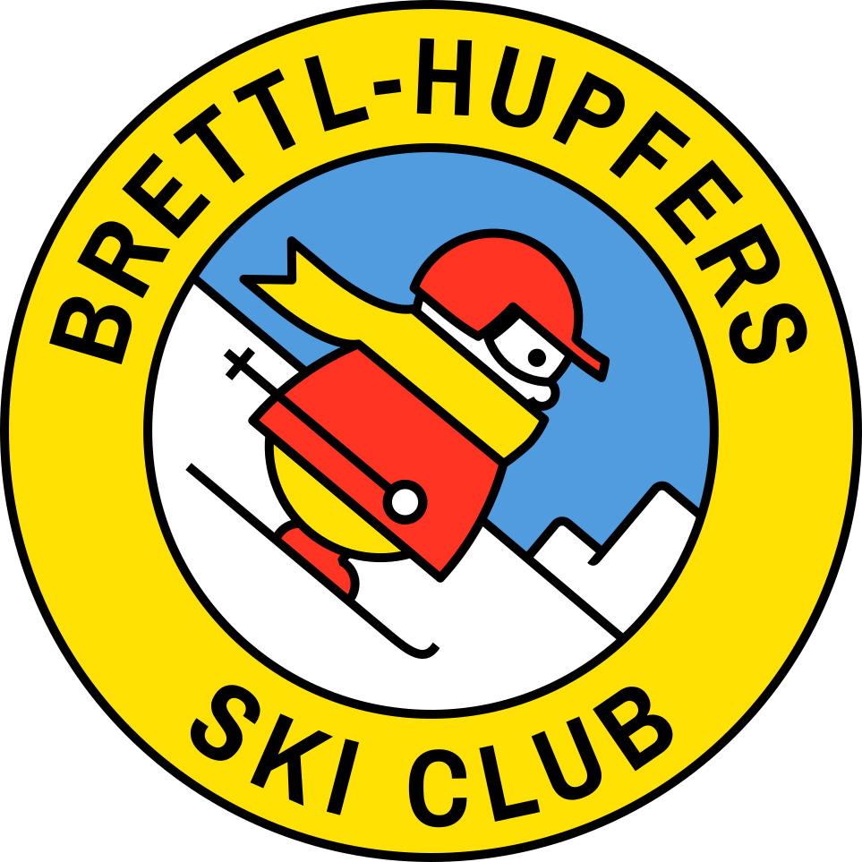

# Brettl-Hupfers Ski & Sports Club



A modern web application for the Brettl-Hupfers Ski & Sports Club, providing members with reservation management, club information, and community features.

## 🏔️ About

The Brettl-Hupfers Ski & Sports Club is a group of men and women united by friendship and a love for skiing, snowboarding, hiking, canoeing, and other outdoor sports year round. Located in Bartlett Village, New Hampshire, the club is just two miles from Attitash/Bear Peak Ski Area and close to 10 other ski areas.

## ✨ Features

### 🎿 Core Functionality
- **User Authentication & Profiles** - Secure member registration and login with Devise
- **Reservation System** - Book lodge stays for specific weeks throughout the season
- **Reservation Management** - View, edit, and cancel reservations with proper permissions
- **Admin Dashboard** - Administrative tools for managing users and reservations
- **Email Notifications** - Password reset and confirmation emails via Brevo SMTP

### 🌐 Public Features
- **Responsive Design** - Mobile-first design that works on all devices
- **Club Information Pages** - Membership info, guest FAQ, AT Week details, volleyball
- **Facebook Integration** - Live social media feed and community updates
- **Professional UI** - Modern design with Tailwind CSS and smooth animations

### 👥 User Management
- **Role-based Access** - Admin and member permission levels
- **Profile Management** - User profile editing and information updates
- **Secure Authentication** - Password requirements and reset functionality

### 📅 Reservation Features
- **Weekly Reservations** - Book specific days of the week for lodge stays
- **Guest Management** - Handle different member types and guest accommodations
- **Dinner Coordination** - Meal planning and special dietary requests
- **Confirmation System** - Automated booking confirmations and tracking

## 🛠️ Tech Stack

- **Backend**: Ruby on Rails 8.0.2
- **Database**: PostgreSQL
- **Frontend**: HTML5, CSS3, JavaScript (ES6+)
- **Styling**: Tailwind CSS
- **Authentication**: Devise
- **Email**: Brevo (Sendinblue) SMTP
- **JavaScript Framework**: Stimulus
- **Build Tools**: Rails Asset Pipeline, Importmaps
- **Social**: Facebook SDK Integration

## 🚀 Getting Started

### Prerequisites

- Ruby 3.3.5 or later
- PostgreSQL 12+
- Node.js and npm (for Tailwind CSS)
- Git

### Installation

1. **Clone the repository**
   ```bash
   git clone https://github.com/your-username/brettl_modern.git
   cd brettl_modern
   ```

2. **Install dependencies**
   ```bash
   bundle install
   ```

3. **Setup the database**
   ```bash
   rails db:create
   rails db:migrate
   rails db:seed
   ```

4. **Configure environment variables**
   ```bash
   # Create a .env file or set environment variables:
   export BREVO_USERNAME='your-brevo-username'
   export BREVO_PASSWORD='your-brevo-password'
   ```

5. **Start the development server**
   ```bash
   bin/dev
   ```

6. **Visit the application**
   Open [http://localhost:3000](http://localhost:3000) in your browser

### Default Admin Access

After running `rails db:seed`, you can log in with:
- **Email**: `admin@brettl.org`
- **Password**: `change_me_now!`

⚠️ **Important**: Change the default admin password immediately after first login.

## ⚙️ Configuration

### Email Configuration

The application uses Brevo (Sendinblue) for email delivery. Configure the following environment variables:

```bash
BREVO_USERNAME=your-brevo-smtp-username
BREVO_PASSWORD=your-brevo-smtp-password
```

### Database Configuration

Update `config/database.yml` with your PostgreSQL credentials:

```yaml
development:
  adapter: postgresql
  database: brettl_modern_development
  username: your_username
  password: your_password
  host: localhost
```

### Facebook Integration

The application includes Facebook feed integration. Update the Facebook page URL in:
- `app/views/welcome/index.html.erb`
- `app/views/layouts/_footer.html.erb`

## 🌐 Network Access

To access the application from other devices on your local network:

```bash
# Start server with network binding
BREVO_USERNAME='your-username' BREVO_PASSWORD='your-password' rails server -b 0.0.0.0 -p 3000

# In separate terminal, start CSS compilation
bin/rails tailwindcss:watch
```

Then access via your local IP address: `http://YOUR_LOCAL_IP:3000`

## 🚀 Deployment

### Heroku Deployment

1. **Create Heroku app**
   ```bash
   heroku create your-app-name
   heroku addons:create heroku-postgresql:mini
   ```

2. **Set environment variables**
   ```bash
   heroku config:set BREVO_USERNAME=your-brevo-username
   heroku config:set BREVO_PASSWORD=your-brevo-password
   heroku config:set RAILS_MASTER_KEY=your-master-key
   ```

3. **Deploy application**
   ```bash
   git push heroku main
   heroku run rails db:migrate
   heroku run rails db:seed
   ```

4. **Configure domain (optional)**
   ```bash
   heroku domains:add your-domain.com
   ```

### Database Migration to Production

To transfer your development data to production:

```bash
# Create database backup
pg_dump -h localhost -U username -d brettl_modern_development -f db/production_backup.sql --no-owner --no-privileges

# Restore to Heroku
heroku pg:backups:restore 'https://your-backup-url/production_backup.sql' DATABASE_URL --app your-app-name
```

## 📱 Usage

### For Members

1. **Registration**: Contact club administrators for account creation
2. **Login**: Use your email and password to access the member portal
3. **Make Reservations**: Browse available weeks and book your lodge stays
4. **Manage Bookings**: View, modify, or cancel existing reservations
5. **Update Profile**: Keep your contact information current

### For Administrators

1. **User Management**: Create, edit, and manage member accounts
2. **Reservation Oversight**: View and manage all club reservations
3. **System Administration**: Access admin dashboard for club management

## 🗂️ Project Structure

```
brettl_modern/
├── app/
│   ├── controllers/         # Application controllers
│   ├── models/             # Data models (User, Reservation, etc.)
│   ├── views/              # Templates and layouts
│   ├── helpers/            # View helpers
│   ├── javascript/         # Stimulus controllers
│   └── assets/            # Images, stylesheets
├── config/                # Application configuration
├── db/                    # Database migrations and seeds
├── lib/                   # Custom tasks and modules
└── test/                  # Test suite
```

## 🤝 Contributing

1. Fork the repository
2. Create your feature branch (`git checkout -b feature/amazing-feature`)
3. Commit your changes (`git commit -m 'Add amazing feature'`)
4. Push to the branch (`git push origin feature/amazing-feature`)
5. Open a Pull Request

### Development Guidelines

- Follow Rails conventions and best practices
- Write tests for new features
- Ensure responsive design compatibility
- Maintain code documentation
- Test email functionality in development

## 🐛 Troubleshooting

### Common Issues

**Email not sending:**
- Check Brevo credentials and configuration
- Verify environment variables are set
- Check spam folders for test emails

**Database connection errors:**
- Ensure PostgreSQL is running
- Verify database credentials in `config/database.yml`
- Check database exists and user has proper permissions

**Asset compilation issues:**
- Run `rails assets:precompile`
- Check Tailwind CSS configuration
- Ensure Node.js and npm are installed

**Facebook feed not loading:**
- Check Facebook SDK integration
- Verify page URL is correct and public
- Check browser console for JavaScript errors

## 📞 Contact & Support

**Brettl-Hupfers Ski & Sports Club**
- **Address**: 1 George Street, Bartlett Village, NH
- **Phone**: (603) 374-9242
- **Email**: brettl.hupfers@gmail.com
- **Facebook**: [@brettl.hupfers](https://www.facebook.com/brettl.hupfers)

**Technical Support**
For technical issues or questions about this application, please:
1. Check the troubleshooting section above
2. Review existing GitHub issues
3. Create a new issue with detailed information

## 📄 License

This project is licensed under the MIT License - see the [LICENSE](LICENSE) file for details.

## 🙏 Acknowledgments

- Built with Ruby on Rails and modern web technologies
- Designed for the outdoor sports community
- Special thanks to all club members and contributors

---

**Made with ❄️ for the ski community**

*Last updated: June 2025*
